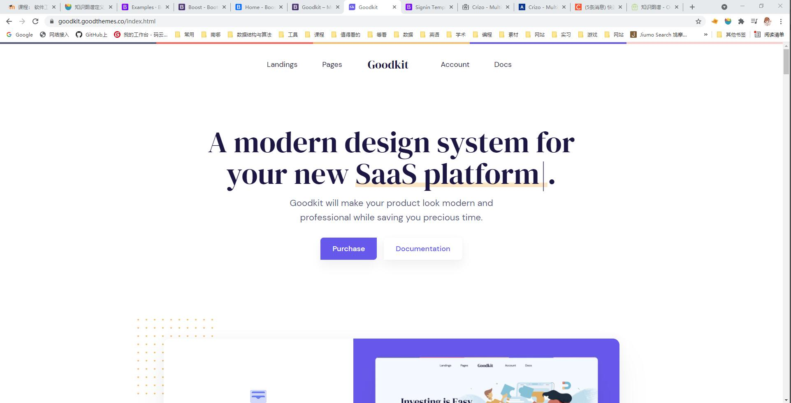
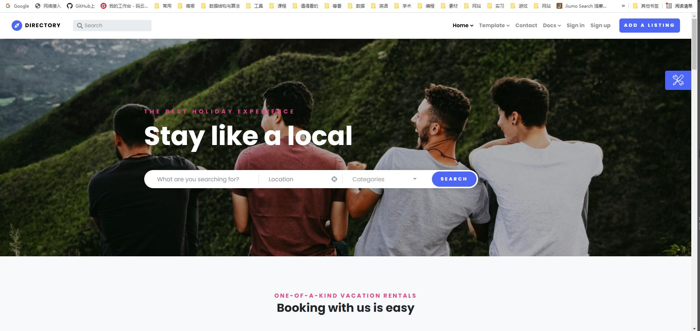
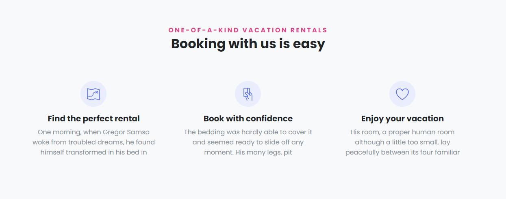
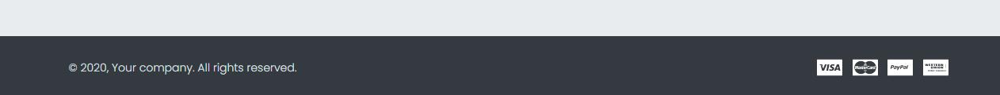
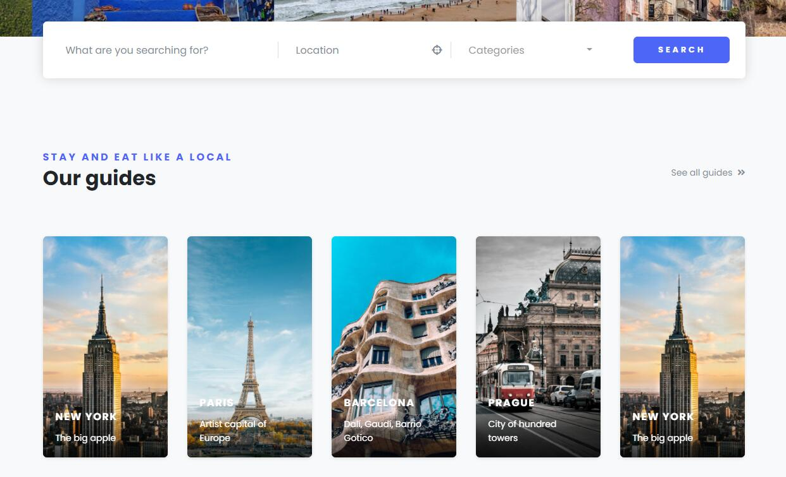
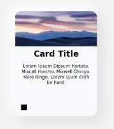
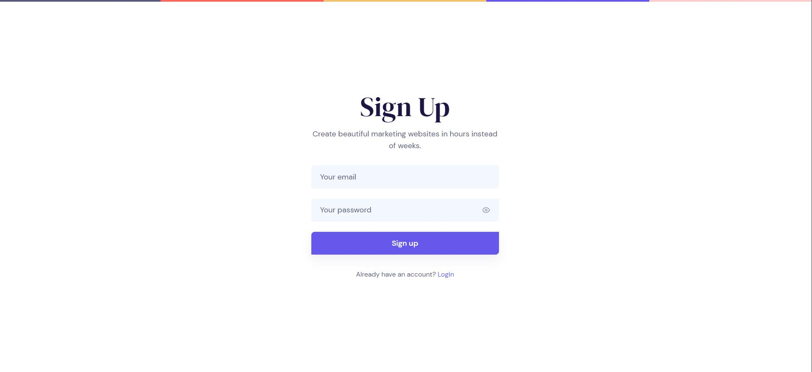
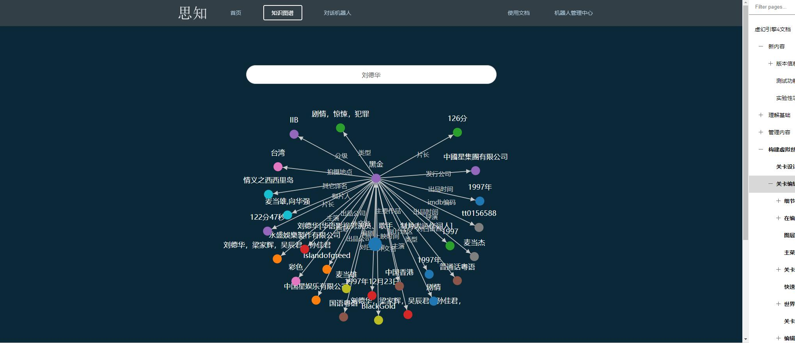
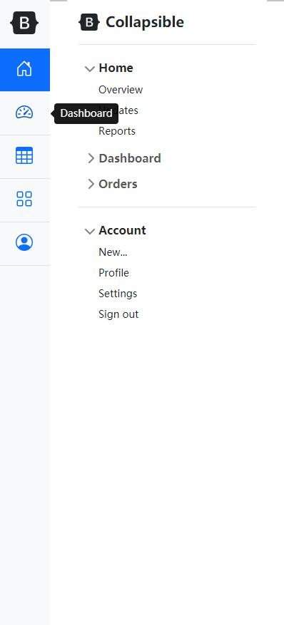

# 前端样式设想

## 整体风格

### 样例

### 配色

背景：255,255,255

文字：27,22,66

组件：102,88,234（浅） 27,22,66（深）

### 关键字

简洁，整齐

## Navbar

- 任何时候固定在上面

- 左侧显示网站名，右侧几个页面跳转 最右是注册（未登录）/用户名（已登录） 先不考虑下拉选项

- 示例（不考虑配色）：

  

## index

- 考虑到我们主题（比如是疫情），在主页上放一大张疫情相关的图片，中间放一个大一点的搜索栏

- 这一块内容下面是基本的介绍 描述一下网站功能（知识图谱编辑，问答，搜索之类的）最下面深色背景的信息栏（邮箱 版权）

- 如果用户点击搜索信息，会在搜索栏下方出现搜索结果栏（取代之前网站功能的内容），每一个搜索结果显示为卡片形式， 有基本配色和节点部分信息，卡片有外阴影，详情见示例

- 示例（图片/搜索框）：

  搜索框可以居中，不用有选项，只有搜索框和搜索按钮，设计的大气一点

  上面可以模仿示例写点东西，比如“你想了解什么”“关于疫情，你想知道的……”

  

- 示例（下面的信息）：

  可以模仿示例做三个信息栏，描述我们知识图谱网站的功能

  底部栏可以不加

  

  

- 示例（搜索信息）

  

- 示例（卡片样式）

  

## login/register

- 页面尽量留白 只显示中间的登录注册组件

- 示例：

  

## 知识图谱页面

- 注：我不太清楚新组件能做成什么样，先描述一下设想

- 知识图谱的画布占满除了Navbar之外的整个界面，右下方悬浮两个半透明按钮，一个用于截图保存，一个用于调出图谱管理窗口

- 节点信息显示不设计具体显示位置，因为画布比较大，可以鼠标移上去在鼠标这里出现一个小窗口显示节点信息

- 管理窗口设计成sidebar的形式，从左边划出来，大约六分之一屏幕大小，覆盖知识图谱画布。包含一些基本操作，比如增删改，功能和之前网站设计中下面的几个选项框类似

- 如果有一些提示信息，显示在网站右上角，或者上方，几秒后消失

- 示例（画布）

  无视这个搜索框，另外我的背景色应该是白色或者淡色

  

- 示例（侧边栏）

  最好也像这样，把大功能分开，作为左边的几个图标，右边现实小功能以及处理输入信息

  

## 问答页面

- 设想是用聊天方式做，不过可能和前面风格不搭，等前面风格出来之后再考虑

